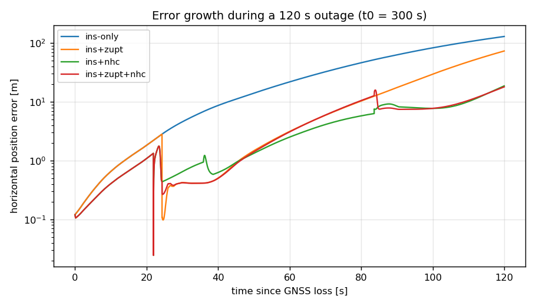
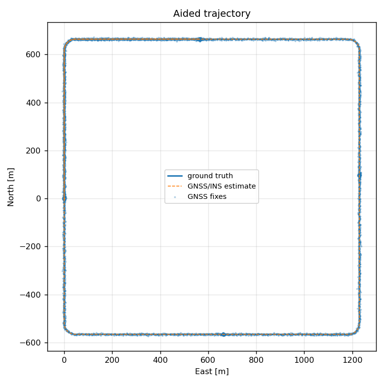
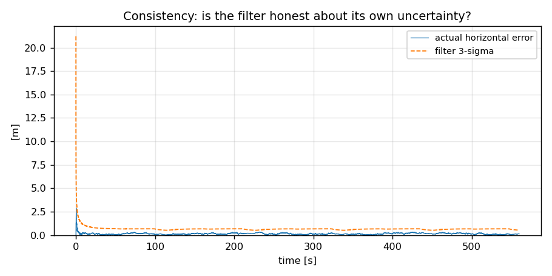

# carcajou

**GNSS-denied vehicle navigation: strapdown INS, error-state Kalman filtering, and a drift benchmark that reports the number vendors are actually held to.**

[](https://github.com/PrimelPJ/carcajou/actions/workflows/ci.yml)


When a vehicle drives into a tunnel, an underground parkade or a downtown
canyon, GNSS stops being an answer. What happens next is decided entirely by
the inertial navigation system and whatever constraints you can afford to add
to it. The industry metric for that is **drift as a percentage of distance
travelled**, and the usual target for automotive-grade autonomy is **under
1 %**.

carcajou builds that system and, more importantly, builds the harness that
proves whether it hits the number.

---

## Headline result

Horizontal position drift during a simulated GNSS outage, as a percentage of
distance travelled. Median / p95 across 24 outage windows (6 window positions
x 4 sensor-noise seeds) on a 6.05 km, 560 s urban circuit at 100 Hz.

**IMU: `industrial-mems`** (the grade automotive systems actually ship)

| aiding during outage | 10 s | 30 s | 60 s | 120 s |
|---|---|---|---|---|
| `ins-only` | 0.36 / 0.73 | 0.86 / 1.58 | 2.03 / 3.92 | 5.36 / 10.24 |
| `ins+zupt` | 0.36 / 0.73 | 0.67 / 1.45 | 1.45 / 3.92 | 3.92 / 10.24 |
| `ins+nhc` | 0.35 / 0.73 | 0.49 / 1.03 | 0.48 / 1.21 | 0.40 / 1.15 |
| **`ins+zupt+nhc`** | 0.35 / 0.73 | 0.21 / 1.03 | 0.22 / 0.64 | **0.22 / 1.15** |

In absolute terms, over a two-minute outage that is a median final error of
**70.6 m unaided versus 2.9 m** with both constraints active, and a p95 heading
error of 0.26 degrees.

**IMU: `consumer-mems`** (the phone/dashcam class part)

| aiding during outage | 10 s | 30 s | 60 s | 120 s |
|---|---|---|---|---|
| `ins-only` | 0.52 / 1.13 | 1.80 / 4.97 | 5.12 / 15.70 | 17.39 / 51.56 |
| `ins+zupt` | 0.52 / 1.13 | 1.10 / 4.94 | 3.78 / 15.70 | 15.73 / 51.56 |
| `ins+nhc` | 0.45 / 1.17 | 0.39 / 2.64 | 1.22 / 3.65 | 1.34 / 20.14 |
| `ins+zupt+nhc` | 0.45 / 1.17 | 0.39 / 2.64 | 1.21 / 3.65 | 1.28 / 20.14 |

**IMU: `tactical`**

| aiding during outage | 10 s | 30 s | 60 s | 120 s |
|---|---|---|---|---|
| `ins-only` | 0.15 / 0.35 | 0.18 / 0.34 | 0.26 / 0.49 | 0.48 / 0.90 |
| **`ins+zupt+nhc`** | 0.15 / 0.35 | 0.12 / 0.22 | 0.05 / 0.13 | **0.04 / 0.10** |

### What the tables say

1. **Unaided inertial navigation misses the 1 % budget somewhere around
   60 seconds** on anything cheaper than a tactical IMU, and then falls apart
   quickly. Error grows as `t^2` through velocity and `t^3` through attitude,
   and nothing bounds it.
2. **Two constraints that cost zero additional hardware recover most of it.**
   ZUPT observes accelerometer bias whenever the vehicle stops; the
   non-holonomic constraint bounds lateral and vertical body-frame velocity,
   and because its Jacobian couples into attitude, it bounds heading drift too.
   Together they take an industrial MEMS part from 5.36 % to 0.22 %.
3. **The non-holonomic constraint does the heavy lifting, not ZUPT.** ZUPT only
   fires when stopped, so its value depends on the drive cycle. NHC applies
   every epoch the vehicle is moving. This is not the ordering most
   introductory treatments imply, and it is the kind of thing a benchmark tells
   you and intuition does not.
4. **Consumer MEMS cannot be rescued by constraints alone.** Median 1.28 % at
   120 s with a p95 of 20 % is not a shippable system. That is the empirical
   case for vision and LiDAR aiding, and it is why Phase 1 exists.



---

## Why you can believe the numbers

The synthetic trajectory generator derives IMU measurements by **algebraically
inverting the discrete mechanization update** in `mechanization.py`, rather than
sampling an idealised continuous model. So a noise-free, bias-free integration
must retrace the reference trajectory exactly.

Measured closure over 6,051 m and 560 s:

| quantity | closure error |
|---|---|
| position | `1.3e-07 m` |
| velocity | `7.2e-10 m/s` |
| attitude | `2.5e-11 deg` |

That is machine precision. It is asserted in CI as
`tests/test_core.py::test_mechanization_reproduces_truth`.

The consequence: **every metre of drift in the benchmark is attributable to a
sensor error that was deliberately injected**, and nothing else. Without that
identity, a plausible-looking drift curve is indistinguishable from an
integration bug.



---

## Quickstart

```bash
git clone https://github.com/PrimelPJ/carcajou && cd carcajou
pip install -e ".[dev,plots]"

pytest -q                          # 16 tests, ~15 s
python scripts/run_benchmark.py    # full sweep, ~20 min on 4 cores
python scripts/run_benchmark.py --laps 2 --seeds 1 --imu industrial-mems  # ~1 min
```

Or with Docker:

```bash
docker build -t carcajou . && docker run --rm -v "$PWD/results:/app/results" carcajou
```

Using the filter directly:

```python
from carcajou import Eskf, EskfConfig, Mechanizer
from carcajou.sensors import INDUSTRIAL_MEMS, SPP

mech = Mechanizer(lat_rad=0.8909, height=1045.0)          # Calgary
ekf = Eskf(mech, EskfConfig(imu=INDUSTRIAL_MEMS, gnss=SPP), initial_state)

for imu in imu_stream:
    ekf.predict(imu, dt)
    if gnss_available:
        ekf.update_gnss_position(fix.p)                    # chi-square gated
    elif ekf.is_stationary():
        ekf.update_zupt()
    else:
        ekf.update_nhc()

    print(ekf.state.p, ekf.sigma()[:3])                    # estimate + 1-sigma
```

---

## Architecture

```
src/carcajou/
  frames.py           SO(3) exp/log, WGS-84, NED tangent plane, Somigliana gravity
  mechanization.py    strapdown INS + continuous error-state Jacobians
  eskf.py             15-state ESKF: GNSS pos/vel, ZUPT, NHC, gating, Joseph form
  sensors.py          IMU and GNSS error models by grade
  pipeline.py         aided pass with snapshots + outage harness
  datasets/
    synthetic.py      self-consistent trajectory and sensor simulator
    kitti.py          KITTI raw OXTS loader with documented frame conversions
  benchmark/
    metrics.py        drift-percent, ATE, aggregation
```

Error state is `[dp, dv, dtheta, db_a, db_g]`, 15 elements. Attitude error uses
the **global/left** convention, `R_true = Exp(dtheta) R_est`, and the full
derivation of the resulting dynamics matrix is in
[`docs/DESIGN.md`](docs/DESIGN.md).

**Benchmark methodology.** Every ablation resumes from the *same snapshot* of a
single GNSS-aided pass: identical state, identical covariance, identical IMU
realisation. Only the aiding available during the outage varies. Re-filtering
each variant from scratch would contaminate the comparison with differences in
initial alignment convergence.



---

## What this does not do yet

Stated plainly, because a navigation filter that hides its limitations is not
usable by anyone downstream. Full detail in `docs/DESIGN.md` section 9.

- **The horizontal covariance is mildly optimistic**, around 95 to 98 percent
  inside 3-sigma against a nominal 99.7. Causes: GNSS error modelled as white
  when real multipath is time-correlated; IMU scale factor and axis
  misalignment not in the state vector; zero lever arm assumed.
- **The KITTI loader has not been validated against a real drive.** Frame
  conversions are documented and `validate_against_truth()` pre-flights rate,
  timestamp jitter and gravity convention, but **no number in this repository
  comes from KITTI.**
- **p95 values are computed over 24 windows per cell.** Indicative, not tight.
  Medians are solid; widen `--seeds` before quoting the tails anywhere serious.
- **No coning or sculling compensation.** Negligible at 100 Hz with automotive
  dynamics; it becomes the dominant term at the 10 Hz KITTI packet rate.

## Roadmap

- **Phase 1** Stereo visual odometry as a filter update, with a segmentation
  mask so features on moving vehicles are never tracked. Ablate the mask on and
  off, on the same harness. This is the phase that has to rescue consumer MEMS.
- **Phase 2** LiDAR odometry (NDT) against a locally built map with dynamic
  returns removed; persist static landmarks and add a map-matching update.
- **Phase 3** ROS2 Humble nodes, C++/Eigen port of the filter hot loop, 21 or
  24-state extension for scale factor and misalignment, hardware-in-the-loop
  replay.

## References

The formulation follows standard treatments, in particular Groves,
*Principles of GNSS, Inertial, and Multisensor Integrated Navigation Systems*
(2nd ed.) for mechanization and the psi-angle error model, and Sola,
*Quaternion Kinematics for the Error-State Kalman Filter* for the error-state
injection and reset. Derivations in `docs/DESIGN.md` are worked from first
principles so the sign conventions are verifiable rather than inherited.

## License

MIT.
