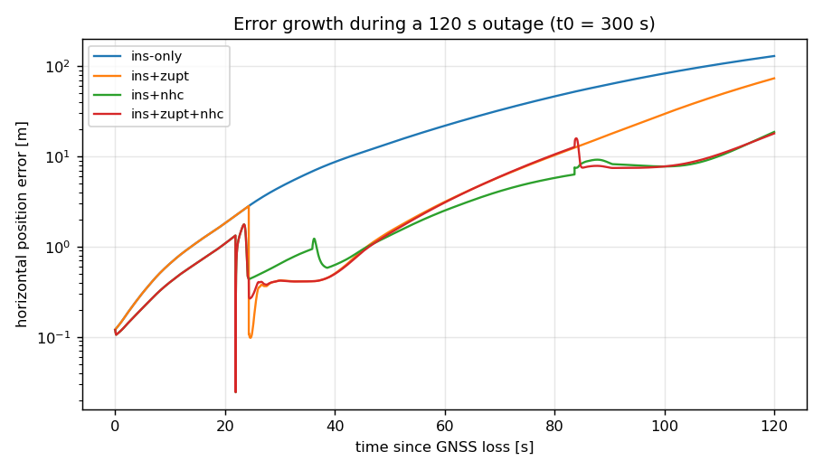
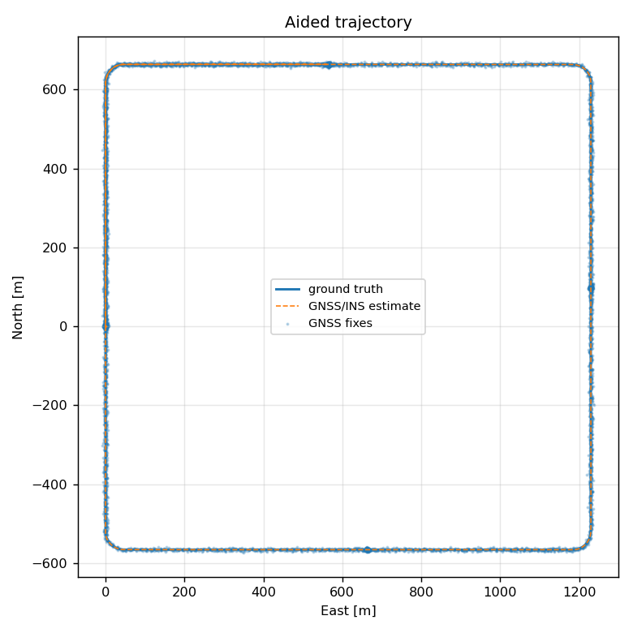
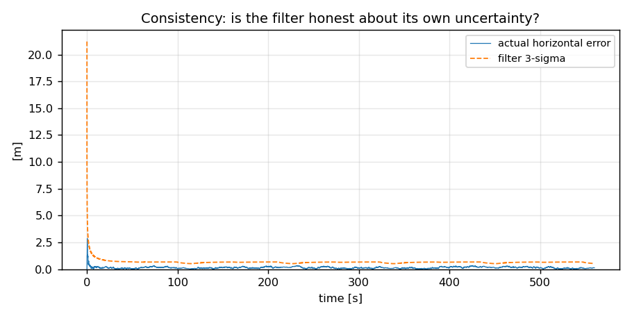

# carcajou

**GNSS-denied vehicle navigation: strapdown INS, error-state Kalman filtering, and a drift benchmark that reports the number vendors are actually held to.**

When a vehicle drives into a tunnel, an underground parkade or a downtown
canyon, GNSS stops being an answer. What happens next is decided entirely by
the inertial navigation system and whatever constraints you can afford to add
to it. The industry metric for that is **drift as a percentage of distance
travelled**, and the usual target for automotive-grade autonomy is **under
1 %**.

carcajou builds that system and, more importantly, builds the harness that
proves whether it hits the number.

---

## Headline result

Horizontal position drift during a simulated GNSS outage, as a percentage of
distance travelled. Median / p95 across 24 outage windows (6 window positions
x 4 sensor-noise seeds) on a 6.05 km, 560 s urban circuit at 100 Hz.

**IMU: `industrial-mems`** (the grade automotive systems actually ship)

| aiding during outage | 10 s | 30 s | 60 s | 120 s |
|---|---|---|---|---|
| `ins-only` | 0.36 / 0.73 | 0.86 / 1.58 | 2.03 / 3.92 | 5.36 / 10.24 |
| `ins+zupt` | 0.36 / 0.73 | 0.67 / 1.45 | 1.45 / 3.92 | 3.92 / 10.24 |
| `ins+nhc` | 0.35 / 0.73 | 0.49 / 1.03 | 0.48 / 1.21 | 0.40 / 1.15 |
| **`ins+zupt+nhc`** | 0.35 / 0.73 | 0.21 / 1.03 | 0.22 / 0.64 | **0.22 / 1.15** |

In absolute terms, over a two-minute outage that is a median final error of
**70.6 m unaided versus 2.9 m** with both constraints active, and a p95 heading
error of 0.26 degrees.

**IMU: `consumer-mems`** (the phone/dashcam class part)

| aiding during outage | 10 s | 30 s | 60 s | 120 s |
|---|---|---|---|---|
| `ins-only` | 0.52 / 1.13 | 1.80 / 4.97 | 5.12 / 15.70 | 17.39 / 51.56 |
| `ins+zupt` | 0.52 / 1.13 | 1.10 / 4.94 | 3.78 / 15.70 | 15.73 / 51.56 |
| `ins+nhc` | 0.45 / 1.17 | 0.39 / 2.64 | 1.22 / 3.65 | 1.34 / 20.14 |
| `ins+zupt+nhc` | 0.45 / 1.17 | 0.39 / 2.64 | 1.21 / 3.65 | 1.28 / 20.14 |
| `ins+zupt+nhc+vo(mask off)` | 0.45 / 1.17 | 0.39 / 2.64 | 1.32 / 3.65 | 1.52 / 19.36 |
| **`ins+zupt+nhc+vo(mask on)`** | 0.49 / 0.68 | 0.37 / 0.65 | 0.37 / 0.74 | **0.42 / 0.92** |

The VO rows are Phase 1: stereo visual odometry consumed as a body-frame
velocity update, with a semantic segmentation mask applied to correspondences
*before* pose estimation. Same snapshots, same windows, same IMU realisation as
every other row (`scripts/run_vision_ablation.py`). The mask is simulated at a
plausible operating point for a real-time segmenter (object recall 0.97,
2 % boundary leak, 2 % static false positives); sweep it, don't quote it.

**IMU: `consumer-mems`** with scan-to-map localization (6 windows per cell,
single seed; widen with `scripts/run_lidar_ablation.py --seeds N` before
quoting tails)

| aiding during outage | 10 s | 30 s | 60 s | 120 s |
|---|---|---|---|---|
| `ins+zupt+nhc` | 0.32 / 0.92 | 0.62 / 2.49 | 0.79 / 2.96 | 1.21 / 1.37 |
| **`ins+zupt+nhc+map`** | 0.12 / 0.16 | 0.05 / 0.08 | 0.02 / 0.03 | **0.01 / 0.02** |
| `ins+zupt+nhc+map(phantom)` | 0.11 / 0.15 | 0.04 / 0.08 | 0.02 / 0.04 | 0.01 / 0.02 |

The map rows are Phase 2: the route is driven once with GNSS available, scans
are posed at the *filter's* estimate (never truth), dynamic returns are removed
by the segmentation mask, and the surviving structure is persisted. Outages
then localize against that map with trimmed, sigma-gated ICP initialised from
the filter's own drifting estimate. Because the map is absolute, error stops
growing with time: a 120 s outage ends at a median of **0.15 m** versus 16 m
for constraints alone, and drift-*percent* falls as the outage lengthens.
The second drive carries fresh sensor noise and different traffic (the lead
vehicle holds a different gap), as a second drive would.

The `(phantom)` row is the honest surprise. It is the identical pipeline with
the mask off at map-build time, so the lead vehicle is baked into the map —
and on this route it changes nothing. The phantom ribbon lies along the
roadway where static structure never is, its along-track geometry makes its
correspondences degenerate rather than biasing, and the sigma-gated refit
absorbs the rest. The mask's measurable value here is map hygiene (the test
suite quantifies a >20x reduction in phantom voxels), not drift. A benchmark
that only produced numbers confirming the sales pitch would not be worth
running; this one says the damage from mapped-in dynamics is contingent on
static density and registration robustness, and quantifying *when* it bites
is future work, stated rather than implied.

**IMU: `tactical`**

| aiding during outage | 10 s | 30 s | 60 s | 120 s |
|---|---|---|---|---|
| `ins-only` | 0.15 / 0.35 | 0.18 / 0.34 | 0.26 / 0.49 | 0.48 / 0.90 |
| **`ins+zupt+nhc`** | 0.15 / 0.35 | 0.12 / 0.22 | 0.05 / 0.13 | **0.04 / 0.10** |

### What the tables say

1. **Unaided inertial navigation misses the 1 % budget somewhere around
   60 seconds** on anything cheaper than a tactical IMU, and then falls apart
   quickly. Error grows as `t^2` through velocity and `t^3` through attitude,
   and nothing bounds it.
2. **Two constraints that cost zero additional hardware recover most of it.**
   ZUPT observes accelerometer bias whenever the vehicle stops; the
   non-holonomic constraint bounds lateral and vertical body-frame velocity,
   and because its Jacobian couples into attitude, it bounds heading drift too.
   Together they take an industrial MEMS part from 5.36 % to 0.22 %.
3. **The non-holonomic constraint does the heavy lifting, not ZUPT.** ZUPT only
   fires when stopped, so its value depends on the drive cycle. NHC applies
   every epoch the vehicle is moving. This is not the ordering most
   introductory treatments imply, and it is the kind of thing a benchmark tells
   you and intuition does not.
4. **Consumer MEMS cannot be rescued by constraints alone, and is rescued by
   masked VO.** Constraints leave it at median 1.28 % / p95 20 % at 120 s; a
   stereo VO velocity update behind a segmentation mask takes it to
   **0.42 % / 0.92 %**, inside the 1 % budget even at the tail. In absolute
   terms: 266 m p95 final error becomes 12 m.
5. **An unmasked camera is worse than no camera.** With the mask off, a lead
   vehicle holding station at ego speed owns enough of the tracked features
   that its motion becomes the RANSAC consensus, and the front end
   confidently votes for zero ego-motion (measured: about -11 m/s of forward
   velocity bias at cruise). The filter's chi-square gate rejects nearly all
   of it, so the median collapses back to the constraint-only baseline, and
   what leaks through poisons the tail (1.52 / 19.36). Detecting and removing
   dynamic objects before the pose estimator is not an optimisation; it is
   the difference between the sensor helping and the sensor lying. That is
   the mask-on/mask-off ablation, and it is the design argument for running
   segmentation in the odometry path at all.



---

## Why you can believe the numbers

The synthetic trajectory generator derives IMU measurements by **algebraically
inverting the discrete mechanization update** in `mechanization.py`, rather than
sampling an idealised continuous model. So a noise-free, bias-free integration
must retrace the reference trajectory exactly.

Measured closure over 6,051 m and 560 s:

| quantity | closure error |
|---|---|
| position | `1.3e-07 m` |
| velocity | `7.2e-10 m/s` |
| attitude | `2.5e-11 deg` |

That is machine precision. It is asserted in CI as
`tests/test_core.py::test_mechanization_reproduces_truth`.

The consequence: **every metre of drift in the benchmark is attributable to a
sensor error that was deliberately injected**, and nothing else. Without that
identity, a plausible-looking drift curve is indistinguishable from an
integration bug.



---

## Quickstart

```bash
git clone https://github.com/PrimelPJ/Carcajou && cd Carcajou
pip install -e ".[dev,plots]"

pytest -q                          # 32 tests, ~50 s
python scripts/run_benchmark.py    # Phase 0 sweep, ~20 min on 4 cores
python scripts/run_benchmark.py --laps 2 --seeds 1 --imu industrial-mems  # ~1 min
python scripts/run_vision_ablation.py   # Phase 1: VO mask-on/mask-off rows
python scripts/run_lidar_ablation.py    # Phase 2: scan-to-map rows
python scripts/run_consistency.py       # Phase 3: 15- vs 24-state 3-sigma claim
```

Or with Docker:

```bash
docker build -t carcajou . && docker run --rm -v "$PWD/results:/app/results" carcajou
```

Using the filter directly:

```python
from carcajou import Eskf, EskfConfig, Mechanizer
from carcajou.sensors import INDUSTRIAL_MEMS, SPP

mech = Mechanizer(lat_rad=0.8909, height=1045.0)          # Calgary
ekf = Eskf(mech, EskfConfig(imu=INDUSTRIAL_MEMS, gnss=SPP), initial_state)

for imu in imu_stream:
    ekf.predict(imu, dt)
    if gnss_available:
        ekf.update_gnss_position(fix.p)                    # chi-square gated
    elif ekf.is_stationary():
        ekf.update_zupt()
    else:
        ekf.update_nhc()

    print(ekf.state.p, ekf.sigma()[:3])                    # estimate + 1-sigma
```

---

## Architecture

```
src/carcajou/
  frames.py           SO(3) exp/log, WGS-84, NED tangent plane, Somigliana gravity
  mechanization.py    strapdown INS + continuous error-state Jacobians
  eskf.py             15-state ESKF: GNSS pos/vel, ZUPT, NHC, gating, Joseph form
  sensors.py          IMU and GNSS error models by grade
  pipeline.py         aided pass with snapshots + outage harness
  vision/
    camera.py         rectified stereo rig: projection, triangulation, depth gate
    world.py          static landmark corridor + a station-keeping lead vehicle
    segmentation.py   simulated mask (quality-sweepable) and ONNX inference path
    frontend.py       tracking, MSAC rigid fit, Huber pixel-space refinement,
                      VO -> body-velocity measurement with defended covariance
  lidar/
    scanner.py        range-gated landmark scans, affine range noise
    registration.py   voxel consolidation, trimmed + sigma-gated weighted ICP,
                      covariance from the converged normal equations
    mapping.py        mask-at-mapping-time dynamic removal, versioned map files
    matcher.py        online scan-to-map matching from the filter's estimate,
                      coarse-to-fine re-acquisition, measured acceptance gates
  datasets/
    synthetic.py      self-consistent trajectory and sensor simulator
    kitti.py          KITTI raw OXTS loader with documented frame conversions
  benchmark/
    metrics.py        drift-percent, ATE, aggregation
```

Error state is `[dp, dv, dtheta, db_a, db_g]`, 15 elements. Attitude error uses
the **global/left** convention, `R_true = Exp(dtheta) R_est`, and the full
derivation of the resulting dynamics matrix is in
[`docs/DESIGN.md`](docs/DESIGN.md).

**Benchmark methodology.** Every ablation resumes from the *same snapshot* of a
single GNSS-aided pass: identical state, identical covariance, identical IMU
realisation. Only the aiding available during the outage varies. Re-filtering
each variant from scratch would contaminate the comparison with differences in
initial alignment convergence.



---

## What this does not do yet

Stated plainly, because a navigation filter that hides its limitations is not
usable by anyone downstream. Full detail in `docs/DESIGN.md` section 9.

- **The covariance-optimism defect is closed — behind a flag.** Phase 3
  added a 24-state extension (`EskfConfig.extended_state`): accel and gyro
  scale factor as random constants, plus a first-order Gauss-Markov GNSS
  position error state. With those errors actually injected by the simulator
  (`corrupt_imu(inject_scale=True)`, the `spp-gm` receiver grade), the
  15-state filter keeps its true error inside its own 3-sigma bound **0.3 %**
  of the time — a filter confidently lying — while the 24-state filter holds
  **100 %** against a nominal 99.7, with horizontal RMS improving 2.84 m to
  2.27 m (`scripts/run_consistency.py`, asserted in CI). The flag defaults
  off so every published table reproduces bit-for-bit; axis misalignment and
  lever arm remain future states, stated rather than hidden.
- **The KITTI loader has not been validated against a real drive.** Frame
  conversions are documented and `validate_against_truth()` pre-flights rate,
  timestamp jitter and gravity convention, but **no number in this repository
  comes from KITTI.**
- **p95 values are computed over 24 windows per cell.** Indicative, not tight.
  Medians are solid; widen `--seeds` before quoting the tails anywhere serious.
- **No coning or sculling compensation.** Negligible at 100 Hz with automotive
  dynamics; it becomes the dominant term at the 10 Hz KITTI packet rate.
- **The VO relative-rotation channel ships disabled by default**
  (`EskfConfig.use_vo_rotation=False`) to preserve existing benchmark tables.
  It is now fully functional with stochastic cloning (Phase 3): the attitude
  is cloned at each VO epoch and the relative-rotation update properly tracks
  cross-epoch correlation, so the covariance needs no inflation factor. Enable
  it with `use_vo_rotation=True` for new work.
- **The vision benchmark uses a landmark world, not rendered images.** Feature
  detection, matching, illumination and occlusion are absorbed into pixel
  noise and outlier-rate parameters (`vision/world.py` states what is and is
  not modelled). This keeps every metre of VO drift attributable, at the cost
  of not exercising a real front end. The ONNX segmentation path exists for
  real imagery and is scored by nothing until the KITTI loader is validated.

## Roadmap

- **Phase 1 — done.** Stereo visual odometry as a filter update, with a
  segmentation mask so features on moving vehicles are never tracked, ablated
  mask-on/mask-off on the same harness. It had to rescue consumer MEMS and it
  does: 1.28 % / 20 % becomes 0.42 % / 0.92 % at 120 s. The relative-rotation
  channel is now enabled via stochastic cloning (Phase 3).
- **Phase 2 — done.** Scan matching against a persisted map built with dynamic
  returns removed, two-pass structure, localization from the filter's own
  estimate. Same sensors, better answer: 1.21 % / 16 m at 120 s becomes
  0.01 % / 0.15 m, and error is bounded rather than growing. ICP was chosen
  over NDT so the covariance argument is shared with the vision front end;
  the module boundary is pose + covariance, so NDT can replace it without
  touching a caller.
- **Phase 3 — done.** The 24-state extension (scale factor + GNSS
  Gauss-Markov) closes the covariance-optimism defect documented above, and
  stochastic cloning for the VO rotation channel properly tracks cross-epoch
  correlation so the channel ships without a covariance fudge factor. Both
  items that required filter-level work are complete and tested.

### Future infrastructure

Items that improve deployment but do not change the filter or its numbers.
They need a build environment this repository's CI does not yet exercise, and
a repo whose thesis is "believe the numbers" does not ship untested code to
look finished.

- **C++/Eigen port** of the filter hot loop.
- **ROS2 Humble packaging.**
- **Hardware-in-the-loop replay.**

## References

The formulation follows standard treatments, in particular Groves,
*Principles of GNSS, Inertial, and Multisensor Integrated Navigation Systems*
(2nd ed.) for mechanization and the psi-angle error model, and Sola,
*Quaternion Kinematics for the Error-State Kalman Filter* for the error-state
injection and reset. Derivations in `docs/DESIGN.md` are worked from first
principles so the sign conventions are verifiable rather than inherited.

---

## Glossary

| Term | Stands for | Plain meaning |
|---|---|---|
| **GNSS** | Global Navigation Satellite System | GPS and equivalent satellite positioning (GPS, GLONASS, Galileo, BeiDou) |
| **INS** | Inertial Navigation System | Dead-reckoning using accelerometers and gyroscopes only |
| **IMU** | Inertial Measurement Unit | The sensor chip: 3-axis accelerometer + 3-axis gyroscope |
| **MEMS** | Micro-Electro-Mechanical System | Silicon-etched sensor technology — cheap (consumer/industrial) vs. expensive (tactical) |
| **ESKF** | Error-State Kalman Filter | A Kalman filter that estimates *errors in* the navigation state rather than the state itself |
| **NHC** | Non-Holonomic Constraint | A car cannot slide sideways or fly — this rule is fed to the filter as a measurement |
| **ZUPT** | Zero-velocity Update | When the vehicle is stopped, velocity must be zero — tells the filter to correct accelerometer bias |
| **VO** | Visual Odometry | Estimating motion from a camera by tracking features frame-to-frame |
| **ICP** | Iterative Closest Point | Algorithm that aligns two point clouds by minimizing point-to-point distance |
| **NDT** | Normal Distributions Transform | Alternative to ICP for point cloud alignment; not used here but mentioned as a swap-in |
| **RANSAC** | Random Sample Consensus | Outlier-rejection algorithm: fits a model to random subsets and keeps the best |
| **MSAC** | M-estimator Sample Consensus | A variant of RANSAC with a smoother cost function, used in the VO front end |
| **ONNX** | Open Neural Network Exchange | Standard format for exporting neural network models (used for the segmentation path) |
| **NED** | North-East-Down | Coordinate frame where X points north, Y east, Z down — standard for aviation/navigation |
| **WGS-84** | World Geodetic System 1984 | The ellipsoid model of Earth that GPS coordinates reference |
| **ATE** | Absolute Trajectory Error | End-to-end position error metric |
| **RMS** | Root Mean Square | Square root of the average of squared values — a common error summary |
| **SPP** | Single Point Positioning | Basic GPS receiver grade; metre-level accuracy, no corrections |
| **p95** | 95th percentile | The value that 95 % of measurements fall below — a tail metric |
| **CI** | Continuous Integration | Automated test runs on every code push (GitHub Actions here) |
| **KITTI** | Karlsruhe Institute of Technology and Toyota Technological Institute | A widely used autonomous driving dataset with camera, LiDAR, and GPS ground truth |
| **ROS2** | Robot Operating System 2 | Middleware framework for robotics; mentioned as a future packaging target |

---

## TL;DR

**The problem:** When a car goes into a tunnel, GPS stops working. The vehicle has to navigate on its own using only its IMU (the chip that measures acceleration and rotation). Raw IMU navigation drifts badly — about 70 metres of error in two minutes on a cheap sensor.

**What this project does:** Builds an inertial navigation filter and a rigorous benchmark that measures exactly how much each technique helps.

**Key results (2-minute GPS outage, automotive-grade sensor):**
- IMU alone: **70 m** median error
- + vehicle physics constraints (NHC + ZUPT): **2.9 m** — free, no extra hardware
- + stereo camera (with moving-object masking): **< 1 %** drift — rescues cheap sensors
- + LiDAR map matching: **0.15 m** — error stops growing entirely

**Why trust the numbers:** The simulator is built so that a perfect sensor produces *exactly* zero drift (verified to machine precision). Every metre of error in the tables came from a sensor imperfection that was deliberately added — not from a bug.

---

## License

MIT — Copyright © 2026 Primel Jayawardana
